# What the storefront looks like

Every page this module renders, on Hyvä 3 with the stock `Hyva/default` theme. Captured from a
clean install with sample content: twelve published posts, one author, one category, two tags,
and one post linked to a product.

Use this as the reference when reviewing a change — if a page stops looking like its screenshot,
something regressed.

> The design intentionally matches the Luma templates in `mage-os/module-blog`. Both themes
> carry the same `mageos-blog-*` classes and the same design tokens, so a page should look the
> same on either. See [Styling](../README.md#styling).

---

## Blog index

`/blog` — the card grid, capped at `mageos_blog/post/posts_per_page` (default 10), with
pagination below when there are more.

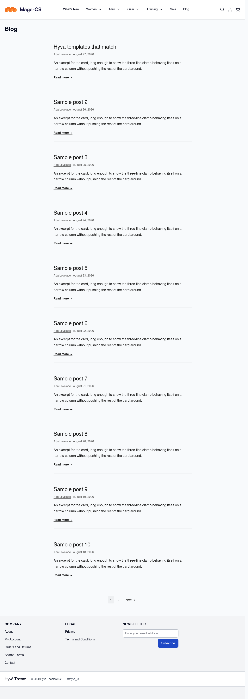

Page two, reached from the pagination:

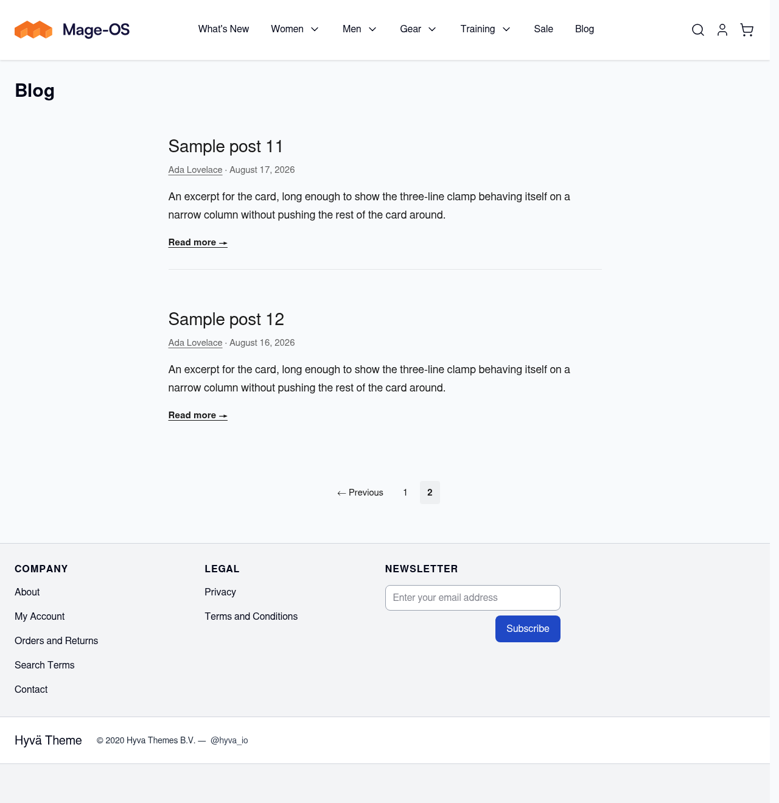

## Post detail

`/blog/<url-key>/` — hero image when the post has one, title, byline, the post body, then tags
and related posts in the footer.

**This is the page to check first after any styling change.** The body is admin-authored HTML,
so nothing here can carry a utility class, and Tailwind's preflight removes the browser defaults
the Luma stylesheet relied on. Headings, list markers, blockquote rules, code blocks, tables and
horizontal rules are all restored by hand in `tailwind/components/post.css`. The sample post
below deliberately contains one of each.

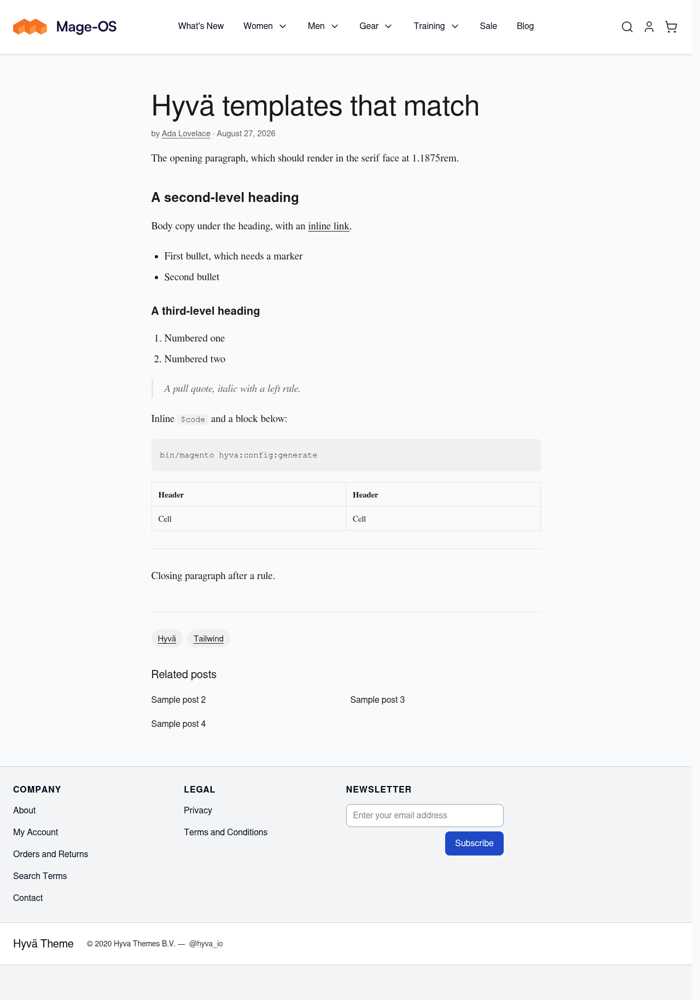

A post with a plain body, for comparison:

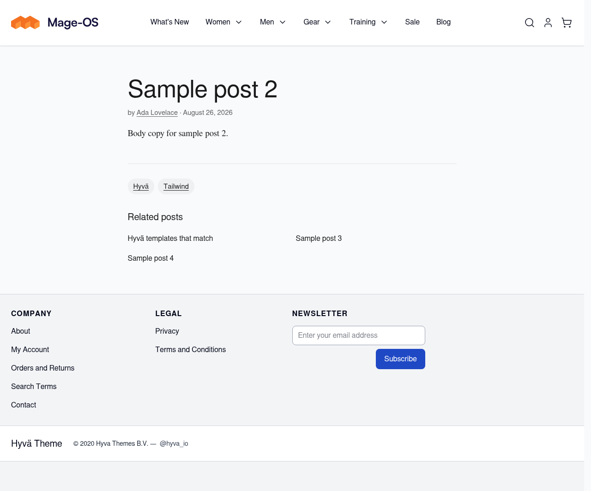

## Category, tag and author

All three share the context header — title, optional description, then the same card grid as the
index.

| | |
| --- | --- |
| `/blog/category/<url-key>/` | 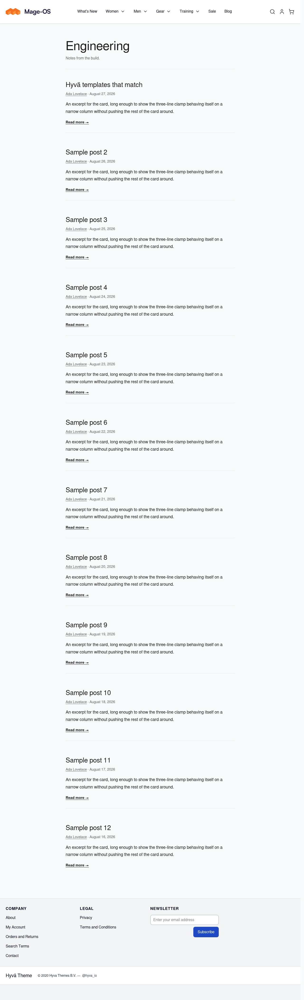 |
| `/blog/tag/<url-key>/` | 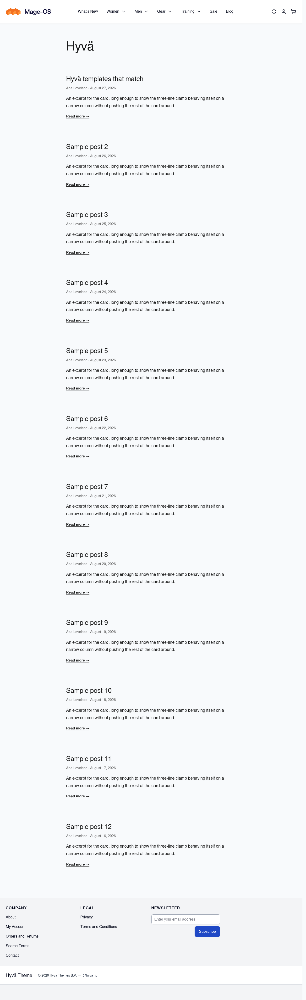 |

The author page adds the avatar and the social links row:

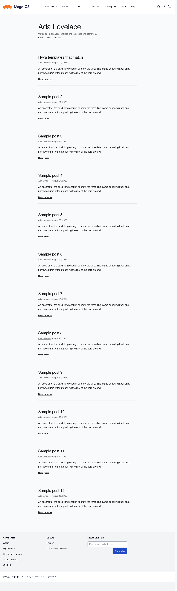

## Search

`/blog/search/?q=…` — heading, result count, cards, pagination.

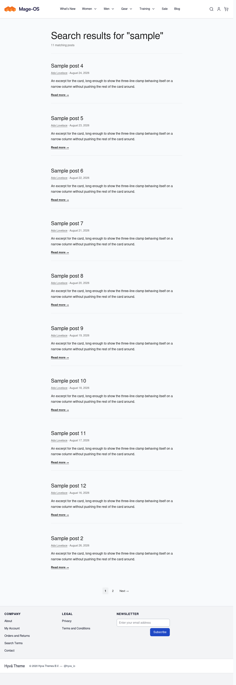

And with no matches:

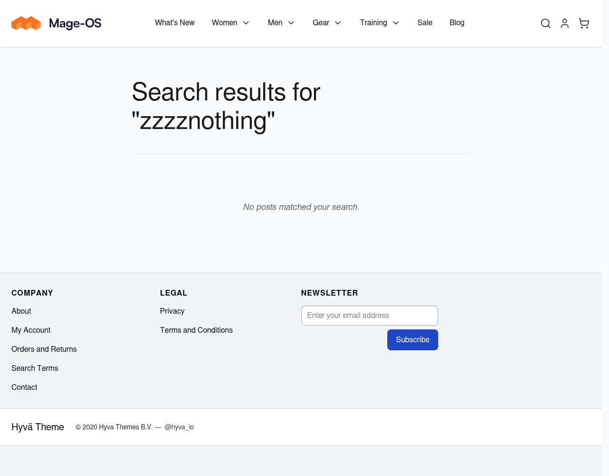

## Related posts on a product page

Gated behind `mageos_blog/related_posts/enabled`, which is **off by default**. When on, posts
linked to the product render as a section in the product information area, titled from
`mageos_blog/related_posts/title`.

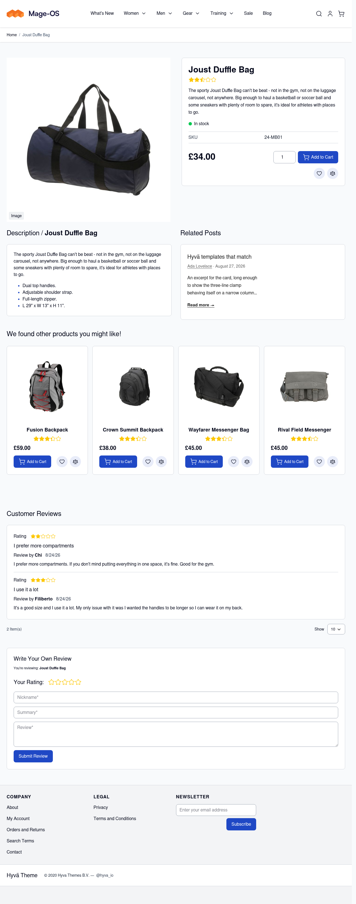

A product with no linked posts must show **nothing at all** — not an empty section, not a
heading. Hyvä skips a section whose block renders blank, so the template returns early rather
than emitting a wrapper. This is easy to break and silent when broken, so it is worth checking
whenever `product/related-posts.phtml` changes:

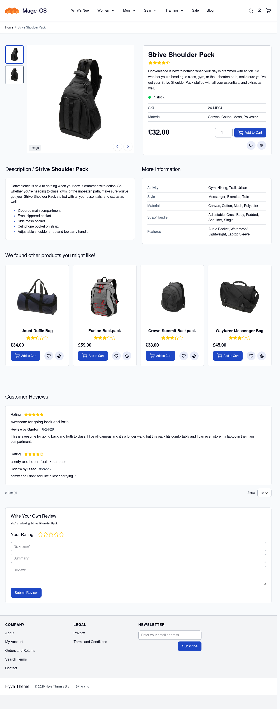

## The menu entry

`mage-os/module-blog` adds its storefront link to `top.links`, a block Hyvä does not define, so
the link silently disappears on a Hyvä theme. This module adds a **Blog** entry to the Hyvä main
menu instead — visible in the header of every screenshot above, after *Sale*.

It follows `mageos_blog/general/enabled`: turn the blog off and the entry goes with it.

## Mobile

The same pages at 420px.

| | | |
| --- | --- | --- |
| Index | Post | Category |
| 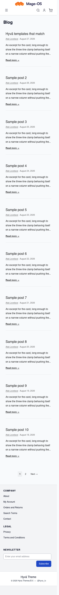 | 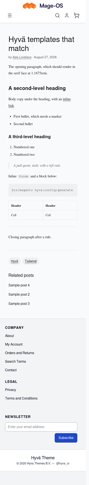 | 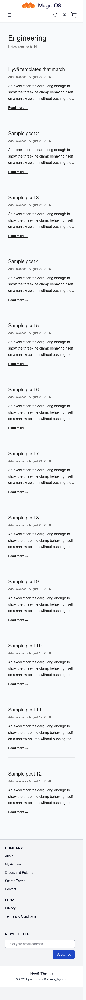 |
| Tag | Author | Search |
| 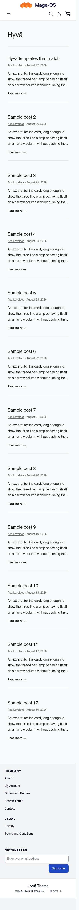 |  | 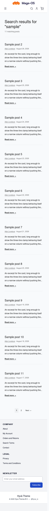 |

---

## Reproducing these

Screenshots come from the containerised test rig, against `Hyva/default` with the module
installed and its Tailwind built:

```bash
bin/install-hyva                 # installs Hyvä and activates the theme
bin/mage module:enable MageOS_Blog MageOS_BlogHyva
bin/mage setup:upgrade && bin/mage setup:di:compile
bin/mage config:set mageos_blog/general/enabled 1
bin/mage config:set mageos_blog/related_posts/enabled 1
bin/mage hyva:config:generate    # registers this module for Tailwind
bin/hyva-build                   # compiles the CSS
```

Sample content was created through the repository API. There is no seeder yet — the direction
for one is in `module-blog-sample-data.md` alongside the module repositories.

If a page renders as Luma rather than Hyvä, it is the rig's full-page cache holding a stale
entry; append a query string to bust it.
